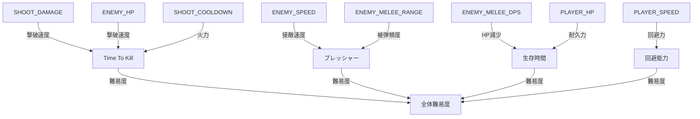

# バランスシート

**本ファイルは数値を複製しない。すべての値は [constants.md](./constants.md) を参照。**

## パラメータ関連表

### プレイヤー

| パラメータ       | 参照                                              | 下流影響                      | 体験指標         |
| ---------------- | ------------------------------------------------- | ----------------------------- | ---------------- |
| PLAYER_HP        | [constants.md](./constants.md#プレイヤー)         | 生存時間                      | 難易度           |
| PLAYER_SPEED     | [constants.md](./constants.md#プレイヤー)         | 回避能力、操作感              | アクション性     |
| ANGULAR_SENSIBILITY | [constants.md](./constants.md#プレイヤー)      | エイム精度、操作感            | 操作快適性       |

### 射撃

| パラメータ       | 参照                                              | 下流影響                      | 体験指標         |
| ---------------- | ------------------------------------------------- | ----------------------------- | ---------------- |
| SHOOT_DAMAGE     | [constants.md](./constants.md#射撃)               | 敵の撃破速度                  | 爽快感           |
| SHOOT_RANGE      | [constants.md](./constants.md#射撃)               | 有効交戦距離                  | マップ活用度     |
| SHOOT_COOLDOWN   | [constants.md](./constants.md#射撃)               | 火力（DPS）                   | 射撃テンポ       |

### 敵

| パラメータ       | 参照                                              | 下流影響                      | 体験指標         |
| ---------------- | ------------------------------------------------- | ----------------------------- | ---------------- |
| ENEMY_HP         | [constants.md](./constants.md#敵共通)             | 撃破に必要な弾数              | 爽快感・難易度   |
| ENEMY_SPEED      | [constants.md](./constants.md#敵共通)             | 接敵までの時間、回避難度      | 緊張感           |
| ENEMY_MELEE_RANGE| [constants.md](./constants.md#敵共通)             | 被ダメージ頻度                | 難易度           |
| ENEMY_MELEE_DPS  | [constants.md](./constants.md#敵共通)             | プレイヤーHP減少速度          | 難易度           |

## 影響関係図

## 調整チェックリスト

### SHOOT_DAMAGE を変更した場合

- [ ] 敵の撃破に必要な弾数（ENEMY_HP / SHOOT_DAMAGE）が適切か
- [ ] SHOOT_COOLDOWN と合わせた DPS が生存時間とバランスしているか

### ENEMY_SPEED を変更した場合

- [ ] プレイヤーが逃げながら撃つことが可能か（PLAYER_SPEED との差）
- [ ] 柱を利用した回避が機能するか
- [ ] ENEMY_MELEE_RANGE と合わせて被ダメージ頻度が適切か

### PLAYER_HP を変更した場合

- [ ] ENEMY_MELEE_DPS に対する生存時間が適切か（HP / DPS 秒）
- [ ] 複数の敵に囲まれた場合のリカバリー猶予があるか

### ENEMY_HP を変更した場合

- [ ] 撃破に必要な弾数（ENEMY_HP / SHOOT_DAMAGE）が適切か
- [ ] 複数の敵を相手にする場合のテンポが良いか
